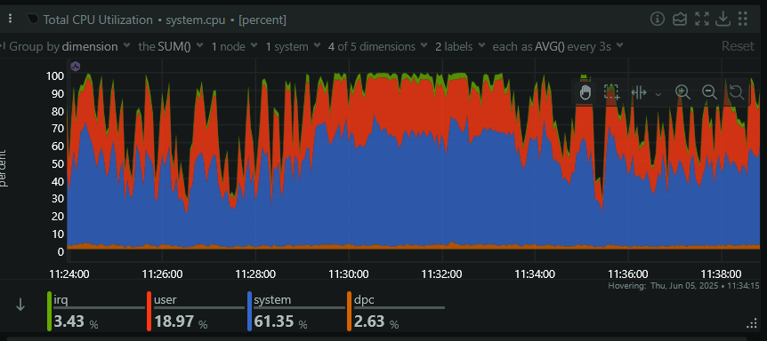
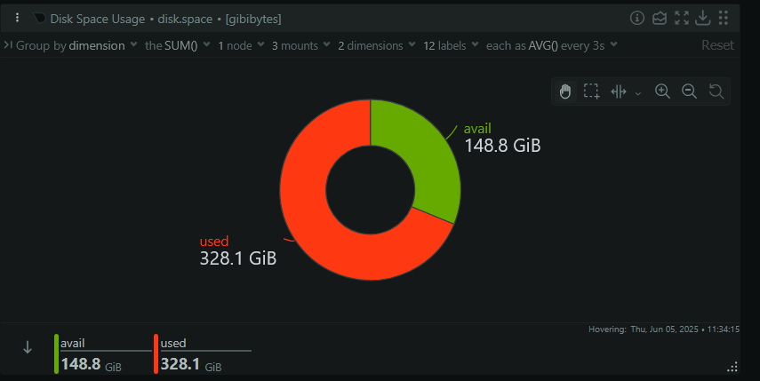
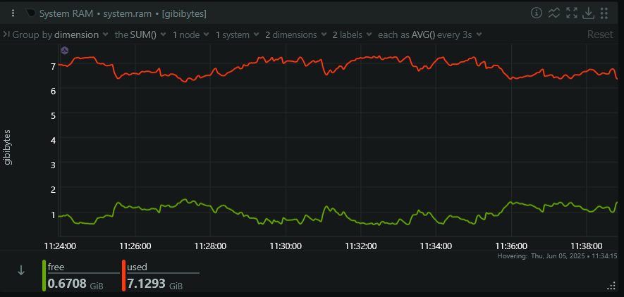
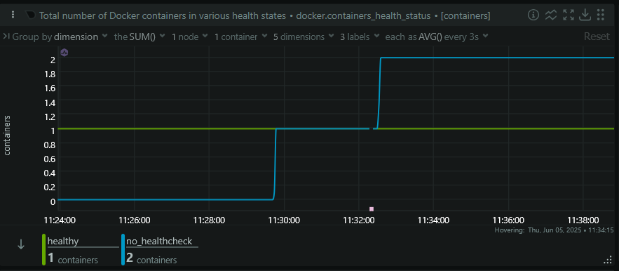
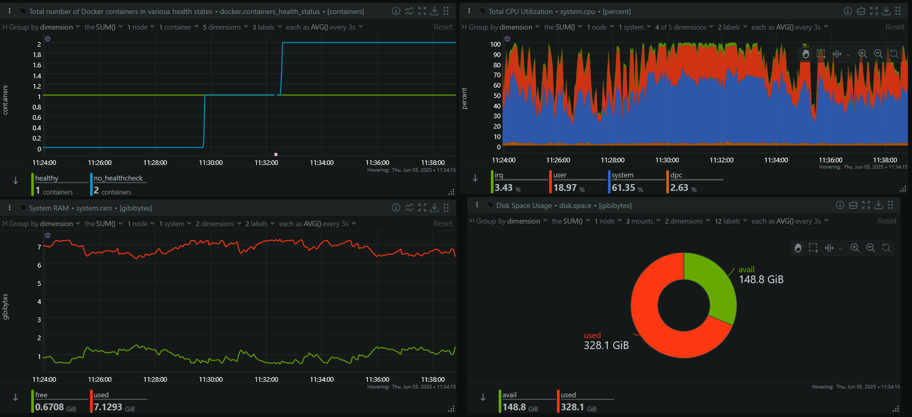
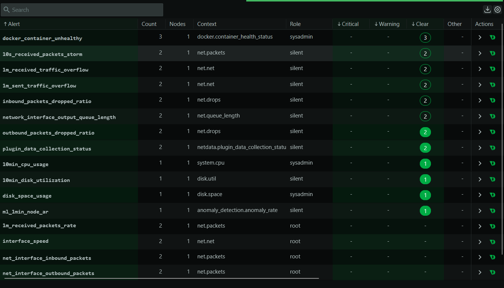
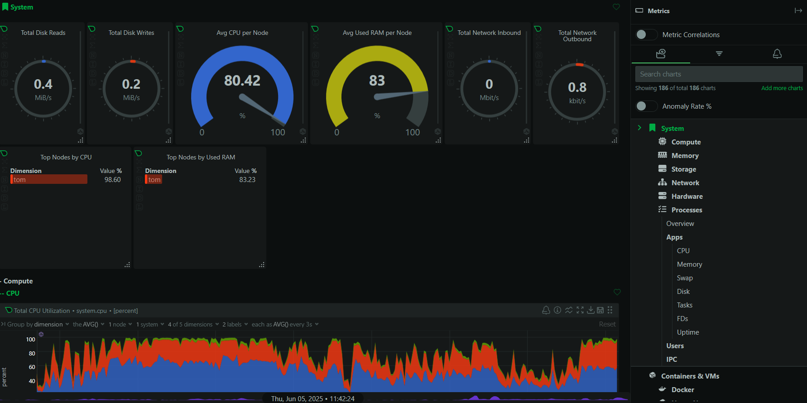
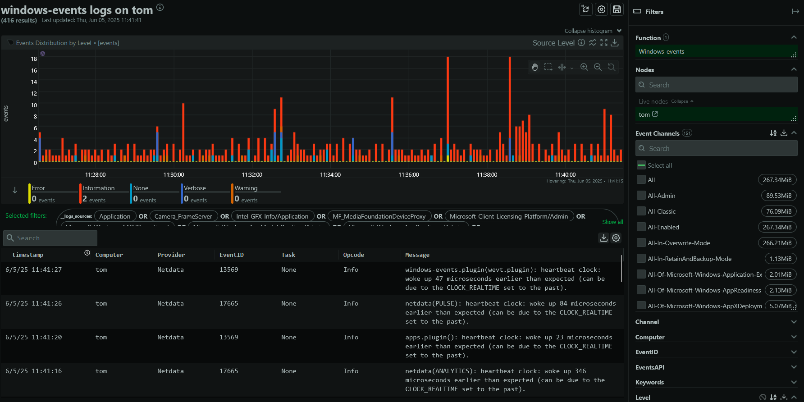

# TASK 7: Monitor System Resources Using Netdata

## 🎯 Objective
 Install Netdata and visualize system and app performance metrics

---

## 🛠 Tools Used
- Docker Desktop (Windows)
- Netdata (Docker container)

- PowerShell / CMD (for logs and interaction)

---

## 🧩 Setup Steps

1. **Pulled Netdata Docker image:**
   ```
   docker pull netdata/netdata
    ```

2. **Ran Netdata container:**
    ```
      docker run -d --name=netdata -p 19999:19999 netdata/netdata
    ```
    
3. **Accessed the real-time dashboard at:**

    ```
    http://localhost:19999
    ```
4. **Claimed the node to Netdata Cloud (optional):**
    ```
    docker exec netdata cat /var/lib/netdata/netdata_random_session_id
    ```
   

## 📈 Metrics & Dashboard Panels

✅ Created and explored dashboard sections for:

  **> CPU usage**
  
  
  
  **> Disk I/O**
  
  
  
  **> Memory usage**
  
  
  
  **> Basic Docker container visibility (health/status)**
  
  
  
### ✅ Explored:
---
  **> Real-time chart panels**
  
  
  
  **> System alerts**
  
  
  
  **> Metrics breakdown per service/component**
  
  
  
  **> Windows Logs**
  
  
    
## 📜 Logs & Debugging
Accessed container logs:

PowerShell:
  ```
  docker logs netdata | Select-String -Pattern "error"
  ```
CMD:
  ```
  docker logs netdata | findstr /I "error"
  ```
output: in netdata-error.txt

These commands helped filter for errors and system issues while running Netdata inside the container.
⚠️ Issues & Workarounds

    ❌ Couldn’t fully access /var/run/docker.sock due to Windows limitation (not using WSL2).

    ✅ Used TCP-based exposure tcp://localhost:2375 and explored non-container metrics.

    ✅ Focused on primary system stats and confirmed dashboard features work as expected.

